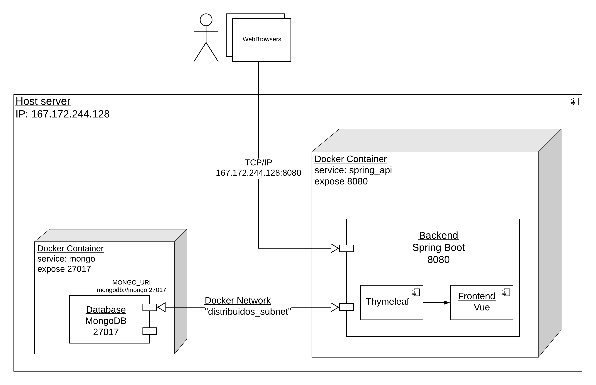
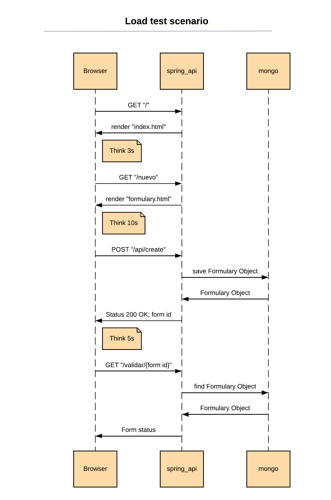
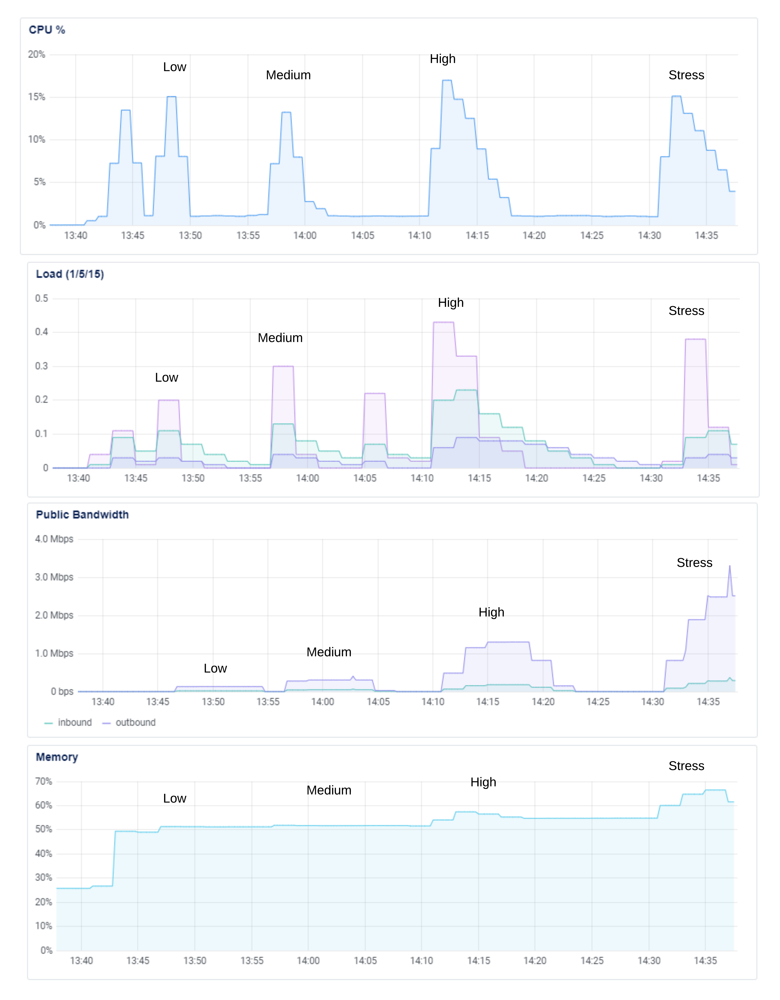

# Documentación Distribuidos 1-2020
Autor: Vicente Rivera


Documentación sobre la arquitectura de los casos de estudio (PEP) Distribuidos 1-2020
## Índice
- Introducción
- Tecnologías utilizadas
- PEP1
    - Arquitectura
    - Análisis sistema distribuido
    - Experimentos
    - Resultados
    - Conclusiones

# Introducción

En los últimos meses, muchos sistemas de información se han puesto a prueba en contextos de crisis. Algunos sitios web han tenido un imprecendente aumento de hasta más de 400% de las visitas. Esto obliga a tener que diseñar arquitecturas distribuidas de escala robustas que puedan soportar esta magnitud de demanda, así como también tratar con la concurrencia, seguridad, entre otros factores.

(http://www.marketersbyadlatina.com/articulo/6518-el-coronavirus-gener%C3%B3-subas-en-visitas-a-sitios-web-de-diversos-rubros)

Los sistemas de aplicaciones web durante los semestres anteriores de la carrera se han focalizado para familiarizarse con las herramientas y tecnologías de software, para aplicarlas en un ambiente controlado local o remoto. Sin embargo en el proceso de despliegue en aplicaciones del mundo real el panorama es muy distinto. El objetivo de este caso de estudio es analizar un sistema de aplicación web desde el paradigma de los sistemas distribuidos de gran escala, identificando falencias y posibles problemas que puede traer una arquitectura, para proponer y desarrollar soluciones. 

En este caso de estudio se emula la página web [Comisaría Virtual](https://comisariavirtual.cl/), en el proceso de solicitud de permisos temporales. La aplicación cuenta con una página "landing", una página con el formulario, y una página para comprobar la validación del permiso.

En esta sección se encuentra la documentación respecto a la primera entrega (PEP1) del sistema distribuido.

# Tecnologías utilizadas

#### Backend: Spring Boot

Framework de Java que simplifica en gran medida el desarrollo las aplicaciones de Java, en especial para configuraciones y funcionalidades CRUD. La ventaja es que permite tener una estructura modular (Modelo-Repositorio-Controlador-Servicio) que organiza el desarrollo. También simplifica las conexiones con componentes externos como bases de datos.

#### Front: Thymeleaf


Thymeleaf es un motor de templates HTML para Java, se utiliza en conjunto con Spring Boot para crear vistas embebidas al backend en HTML/CSS/JS de manera de crear un sistema MVC.
La justificación de elegir esta tecnología es crear en primera instancia una simulación de un sistema monolítico (Backend + Frontend) dentro del servidor.
Ya que se trata de una aplicación simple en términos de vistas (sólo vista principal, formulario, y vista de validación del formulario), hacer esto trae algunas ventajas:
 - Menor complejidad del sistema (se eliminan conexiones remotas Back-Front)
 - Componentes más ligeros
 - Menor latencia (si este estuviera en un servidor remoto)

#### Front: Vue (+ Bootstrap)


Vue es un framework de JavaScript que es útil para construir single page applications (SPA) y es un software centrado principalmente para la creación de las vistas de la aplicación. Se cuenta con experiencia en el uso de Vue, por lo que se utilizará en conjunto con Thymeleaf para el renderizado de las vistas.

#### MongoDB


MongoDB es una base de datos noSQL capaz de manejar grandes cantidades de datos, lo que lo hace ideal para sistemas de escala. En este caso de estudio se trabaja con un modelo simple de formulario. Esta estructura al ser simple y sin relaciones, se considera que una base de datos de documentos sería la opción más adecuada. Además, Mongo es flexible en cuanto a su estructura schema-less modificable fácilmente en caso de ser requerido (facilita el desarrollo). A continuación se muestra el modelo en Java que representa el Objeto guardado en MongoDB.

```java
 # models/Formulary.java
 String name;    // Nombre del que emite el permiso
 String rut;     // RUN/DNI del emisor
 String motive;  // Motivo de solicitar el permiso
 String address; // Dirección del emisor
 Boolean is_valid; // Indica si es válido o ha expirado
 LocalDateTime requestTime; // Fecha y hora emisión permiso
 LocalDateTime expirationTime; // Fecha y hora de expiración permiso
```

#### Docker y Docker Compose


Docker es una plataforma de virtualización que permite modularizar aplicaciónes y aislar ambientes de desarrollo sin tener que utilizar máquinas virtuales. El uso de contenedores para el despliegue de aplicaciones es vital, ya que facilita el mantenimiento, desarrollo, y elimina problemas de incompatibilidades con el hardware y software de los servidores. En este proyecto se utiliza Docker Compose para organizar de manera centralizada los containers de Docker.


# PEP1

## Acceso a la página web

Para acceder a la aplicación, dirigirse a http://167.172.244.128:8080/. La página principal se encuentra vacía, debe utilizar el navegador en la parte superior para acceder al formulario. Para acceder a la validación, se debe crear un formulario y utilizar el link que le aparece luego de enviar el formulario.

## Arquitectura

Aquí se muestra el diagrama arquitectural de la aplicación.



El servidor tiene las siguientes características:
- Arquitectura: Ubuntu 18.04 (LTS) x64 (VM compartida)
- 1 CPU (sin información del procesador)
- Memoria: 1GB RAM
- Almacenamiento: 25GB SSD
- Nombre cluster: NY3 (New York)
- IPv4: 167.172.244.128

## Análisis sistema distribuido

En esta sección se caracterizan y evalúan las características del sistema desde la perspectiva de un sistema distribuido.

#### Disponibilidad de recursos

La aplicación Web dispone el acceso público de todos sus recursos. En este caso se trata sólo de una aplicación de pruebas, por lo que no fue necesario ningún módulo de seguridad en cuanto a autenticación ni encriptamiento. En cuanto a la seguridad del servidor, se encuentra disponible el acceso ssh con ssh-key privada, además cuenta con contraseña de acceso. La vulnerabilidad de este sistema es que si se llegara a acceder a este servidor, tiene a todos sus componentes al descubierto.

Este sistema se considera abierto ya que provee, por razones didácticas, una API para comprobar directamente el correcto funcionamiento de la creación de formularios desde la URL. Este nivel de disponibilidad simplifica el desarrollo y las pruebas de estrés del sistema. Evidentemente, esta información es confidencial para los usuarios, por lo que normalmente se ocultaría o bloquearía su acceso.

```sh
GET 167.172.244.128/api/all
GET 167.172.244.128/api/{id}
POST 167.172.244.128/api/create
```

#### Transparencia

Existen varias dimensiones en que la transparencia de un sistema entra en juego. Se presenta una tabla resumen de cada uno de ellos, y su posterior análisis:

| Dimensión | Descripción |
| -- | -- |
| Acceso | Acceso a recursos es único para el usuario, independiente del modo acceso a recursos utilizado dentro del sistema |
| Ubicación | Desconocimiento de la ubicación física de los recursos |
| Migración | Desconocimiento de la habilidad de los recursos para migrar a otra ubicación |
| Reubicación | Migraciónes no afectan a los recursos en uso ni da cuenta del procedimiento |
| Replicación | Replicación de los recursos se observan como una sola instancia para el usuario |
| Concurrencia | Oculta el proceso y efectos de la concurrencia, manteniendo consistencia |
| Fallos | Oculta lo posible los fallos internos y procesos de recuperación |
| Persistencia | Oculta la volatibilidad de los recursos y datos al usuario |

- **Acceso:** El servidor no posee un nombre de dominio DNS, por lo que compromete altamente la ubicación física del servidor. En caso de existir un cambio de la IP por parte del ISP, la IP antigua dejará de servir para acceder al recurso.
- **Ubicación:** Los recursos de datos del sistema estan ubicados persistentemente en un sólo contenedor, por lo tanto a menos que éste deje de estar disponible, la ubicación de los recursos no es relevante
- **Migración:** Es posible realizar la migración de datos correcta dado que la imagen de docker permite un almacenamiento persistente durante el proceso de despliegue con docker compose. Es decir, incluso si se migrara a otro servidor, mientras se aplique el mismo script se podran acceder a los recursos.
- **Reubicación:** Al tener componentes dockerizados utilizando scripts de docker-container, el proceso de migración es relativamente sencillo (no se trabajó con integración continua dado que es un proyecto pequeño). Sin embargo, se incumple ya que no existe un acceso único para poder direccionar correctamente el sistema durante y posterior al proceso de migración.
- **Replicación:** No aplica, ya que se trata de un sistema monolítico. El defecto de esto es que no se puede beneficiar de un crecimiento horizontal y resistencia a fallos, por lo que no tiene una alta disponibilidad. Esto se puede solucionar con Kubernetes, permitiendo crear réplicas, recuperación de errores y balanceo de carga
- **Concurrencia:** No aplica, ya que se trata de un sistema monolítico. No la cumple en el caso de que existan muchas consultas simultaneas (acceso al mismo recurso dentro de 1 sólo servidor), el usuario podría notar una alta latencia.
- **Fallos:** No cumple esta característica ya que no existe ningun sistema de respaldo ante fallos del sistema principal (no hay réplicas). No hay manera de ocultar un error de ese modo.
- **Persistencia:** Se cumple ya que el usuario no le afecta la manera que estan almacenados los recursos. Se emplea una base de datos persistente que puede ser modificada, y no es eliminada interamente (por ejemplo, caché o logs de escritura antiguos). Mongo trabaja con los datos en memoria pero se asegura de almacenarlos en almacenamiento persistente al terminar los procesos.

#### Apertura

El sistema posee una estructura simple de utilizar. En términos de un sistema distribuido, no se requiere el uso de llamadas a procesos remotos (RPC) ya que docker compose crea una red virtual que une a los contenedores para que se comuniquen como si estuvieran en la misma máquina (estar en contenedores los aisla unos de otros), reduciendo la complejidad significativamente. El hecho de estar conformado por módulos estáticos (IP y puertos únicos), y trabajar con mensajes universales JSON quita la necesidad del uso de emplear lenguajes de definición de interfaces (IDL) y cualquier tipo de Broker intermediario.

- **Interoperabilidad:** No implementa medios de interoperabilidad a un sistema o cluster externo, el proceso de conexión debe hacerse manualmente por medio de la IP y puertos del servidor.
- **Portabilidad:** Este sistema es altamente portable gracias a estar desplegado en Docker, creados automáticamente a través de scripts (Dockerfile y deployement.yml). Los requisitos de portabilidad son: (1) Instalar Docker, (2) Instalar Git
- **Facil extensión:**: Gracias a la red creada docker compose, agregar componentes dockerizados es sencillo, ya que basta con incluirlos dentro del archivo deployement.yml, sin necesidad de especificar las IP dentro cada una de las aplicaciones del sistema, ya que cuenta con un [sistema de resolución de IP](https://docs.docker.com/compose/networking/) en base al nombre de los servicios . 

#### Escalabilidad

Una capacidad esencial de un sistema distribuido es su capacidad de escalar para adaptarse a cambios de la demanda y consultas simultáneas a los recursos. Esto se logra por medio de crecimiento vertical y horizontal, ademas de la implementación de técnicas de comunicación entre nodos y concurrencia de acceso.

- **Vertical:** El servidor es monolítico, dentro de un sólo servidor físico, por lo que se beneficia en gran medida del crecimiento vertical (Se puede contratar un mejor plan de recursos). Actualmente se cuenta con sólo 1 GB de RAM, corriendo varias 2 instancias de Docker, por lo que no soportaría un sistema real de consultas. La ventaja de este sistema es que se reduce lo más posible el overhead de la comunicación entre Frontend y Backend. Esto ideal cuando no se cuenta con la posibilidad de escalar horizontalmente y se quiere una menor latencia pero indeseable para un sistema real cuando la alta disponibilidad es necesaria, ya que fallos en un componente significan fallos fatales en el sistema completo. 
- **Horizontal:** Ya que no existe presupuesto para más de un servidor, un escalamiento horizontal para separación de componentes en múltiples máquinas no es posible (Frontend, Backend, DB, o separando módulos de validación y creación de formularios como microservicios). La opción más viable para enfrentar este problema es la replicación de contenedores utilizando Kubernetes, de manera que se implemente un balanceo de carga y se optimice el tiempo de uso de los recursos disponibles.

## Experimentos

Para poner a prueba las capacidades de este sistema, se emplearon pruebas de carga con [Artillery.io](https://artillery.io/). Esta herramienta de sencilla instalación y operación en CLI permite crear escenarios de uso y realizar múltiples llamadas API al sistema. La razón de elegir Artillery es que a diferencia de comandos como nmap, se se dispone de captura de resultados para su uso en otras consultas. Esto permite que se realice las pruebas sobre ambos módulos de creación y validación de permisos, ya que se captura la id del permiso en su creación. Existen otras herramientas como JMeter o Gatling, sin embargo traen demasiada complejidad al usar grabaciones manuales del flujo o utilizar scripts mas complejos, es por esto que se considera artillery como la opción más adecuada.

```sh
# artillery/artillery.yml
config:
  target: "http://167.172.244.128:8080"
  phases:
    - duration: 10
      arrivalRate: 1
  payload:
    path: "form_values.csv"
    fields:
      - "name"
      - "rut"
      - "motive"
      - "address"
  environments:
    low:
      phases:
        - duration: 60
          arrivalRate: 2
          rampTo: 10
    medium:
      phases:
        - duration: 60
          arrivalRate: 5
          rampTo: 10
        - duration: 60
          arrivalRate: 10
    high:
      phases:
        - duration: 120
          arrivalRate: 10
          rampTo: 15
        - duration: 60
          arrivalRate: 15
          rampTo: 30
    stress:
      phases:
        - duration: 120
          arrivalRate: 30
        - duration: 120
          arrivalRate: 30
          rampTo: 60
scenarios:
  - name: "Fill and send form"
    flow:
      - get:
         url: "/"
      - think: 3
      - get:
         url: "/nuevo"
      - think: 10
      - post:
         url: "/api/create"
         json:
          name: "{{name}}"
          rut: "{{rut}}"
          motive: "{{motive}}"
          address: "{{address}}"
         capture:
          json: $.id
          as: "id"
      - think: 5
      - get:
         url: "/validar/{{ id }}"
         ifTrue: "id"
```

En resumen, el experimento consiste en 4 niveles de carga "low", "medium", "high" y "stress"
- **low:** Entran 2 usuarios virtuales (VU) cada segundo, aumentando progresivamente hasta 10 por segundo durante 1 minuto. En total 362 VU
- **medium:** Entran 5 usuarios por segundo aumentando progresivamente hasta llegar a 10 por segundo durante 1 minuto, luego entran 10 usuarios por segundo durante 1 minuto. En total 1069 VU
- **high:** Entran 10 usuarios por segundo aumentando progresivamente hasta 15 usuarios por segundo durante 2 minutos, luego aumenta hasta 30 usuarios por segundo en un intervalo de 1 minuto. En total 2873 VU
- **stress:** Entran 30 usuarios por segundo durante 2 minutos, luego aumentan progresivamente hasta 60 usuarios por segundo en un período de 2 minutos. En total 9030 VU

Cada VU realiza un flujo, que se encuentra bajo "scenarios:". Este flujo contiene 4 consultas al servidor en total. Una representación gráfica se puede ver a continuación:



## Resultados

Los resultados completos y gráficos se encuentran la carpeta /artillery, se muestran los resultados a través del plugin de monitoreo que provee DigitalOcean. Se marcan en los gráficos el período de tiempo en que se realizan los 4 niveles de cargas.



Artillery crea un reporte automáticamente sobre los resultados obtenidos. Se compone inicialmente de los datos agregados del total de las pruebas, y de los resultados intermedios cada 10 segundos. Resumiendo la información obtenida en los reportes de artillery, se construye la siguiente tabla comparativa. Estos corresponden a los valores agregados del test completo. RPS mean significa la media del número de requests completadas por segundo. Los valores Min/Max/Median/p95 corresponden a las latencias totales del escenario en promedio, medido en milisegundos. p95 indica el percentil 95 promedio de las latencias obtenidas.

| Test | Total Requests | Completed Requests (%) | RPS mean | Min | Max | Median | p95 |
| -- | -- | -- | -- | -- | -- | -- | -- |
| low | 1448 | 1448 (100%) | 18.48 | 143 | 1666 | 173 | 345 |
| medium | 4276 | 2799 (65.5%) | 15.96 | 144.4 | 88577 | 310.4 | 2490 |
| high | 11492 | 8289 (72.1%) | 28.13 | 142.5 | 115913 | 1340.5 | 20833 |
| stress | 36120 | 11174 (30.9%) | 42.66 | 142.8 | 117413 | 4999.7 | 34111 |

Todas las consultas completadas entregaron status 200, sin embargo ocurrieron distintos errores:

| Test | ECONNRESET | ETIMEDOUT | ESOCKETTIMEDOUT |
| -- | -- | -- | -- |
| low | 0 | 0 | 0 |
| medium | 199 | 278 | 1 |
| high | 1254 | 386 | 746 |
| stress | 2638 | 4681 | 4634 |

## Conclusiones

El análisis del sistema desde la perspectiva de sistemas distribuidos ayuda a identificar las falencias y proyectar lo que ocurriría al llevarlo a producción. Si bien un sistema como este tiene potenciales problemas de disponibilidad, la implementación y despliegue es sencillo, además de tener una reducida latencia al contener todos sus componentes en un ambiente local. Sin embargo, un ambiente monolítico no es sustentable como sistema de escala por muchas razones. Luego de realizar las pruebas de estrés y monitoreo se logró aprender de las capacidades reales de este sistema, comprobando la necesidad de los sistemas distribuidos.

Se puede ver que el sistema no tiene la capacidad para suportar las pruebas realizadas, el límite de estrés, considerando aquel sin errores de conexión, se encuentra entre los niveles low y medium. Un factor que puede haber influido en el número de casos completados es que si falla la creación del formulario, falla también la validación a causa de la condición configurada dentro del flujo (el total de consultas es el ideal, pero a causa de la condición se realiza un número menor). Los VU tampoco realizan reintentos, por lo que cualquier tipo de error es considerado un fallo definitivo de esa consulta. 

Se puede ver el efecto de la concurrencia en el valor del RPS, creaciendo a medida que aumenta el número de consultas. Esto le da un mejor desempeño pero no es posible responder a tiempo todas las consultas, ocurriendo errores de conexión y timeout. Tampoco se tiene la capacidad de respuesta necesaria ya que todo depende del servidor monolítico, sin contar replicaciones o balanceo de carga.

Observando los gráficos de monitoreo, se observa que no se aprovecha todas las capacidades del servidor:
- CPU no supera el 15% en las pruebas, y pruebas de mucho mayor carga como "stress" pueden tener incluso menor uso del CPU que una prueba con menor carga como "high".
- Entre la primera prueba "low" y la última "stress", el uso de la memoria es menor a 70%, aumentando menos del 20%. Esto significa que no ocurre swapping, y es corroborado con el bajo uso del disco.
- El gráfico de carga (Load 1/5/15) se refiere a la razon de procesos activos y en espera, a la capacidad total del CPU. Las variaciones 1/5/15 afecta el intervalo de tiempo en la calculación, lo que no es relevante. Sin embargo, esto muestra que podrían existir más procesos en la CPU en ejecución y espera.

Esto da a entender que es posible incluir réplicas mientras que no se supere la capacidad de la memoria para evitar swapping. La estrategia es aumentar el procesamiento de consultas a la CPU manteniendo controlado el uso de la memoria (dado que no se posee suficiente crédito en Digital Ocean para mejorar el servidor). 

Dado este análisis se proponen dos alternativas para mejorar el sistema:

(1) Separar módulos backend y frontend: Hacer el proceso de validación como un módulo del backend independiente para así dividir la carga de trabajo. Evaluar el efecto de la separación del frontend.

(2) Utilizar Kubernetes: Kubernetes permite crear réplicas del sistema monolítico actual, para así aplicar un balanceador de carga. Se puede aplicar la alternativa (1) con Kubernetes, sin embargo es probable que se supere la capacidad de la memoria disponible y empeore el sistema actual.

Estas alternativas y otras posibles se evaluarán dependiendo de las capacidades del servidor, y se desarrollarán en la siguiente entrega del caso de prueba.
